# intelligent_placer

<h2>Постановка задачи</h2>
Требуется создать “Intelligent Placer”: по поданной на вход фотографии нескольких предметов на светлой горизонтальной поверхности и многоугольнику понимать, можно ли расположить одновременно все эти предметы на плоскости так, чтобы они влезли в этот многоугольник. Предметы и горизонтальная поверхность, которые могут оказаться на фотографии, заранее известны. Также заранее известно направление вертикальной оси Z у этих предметов. 
 
<h3>Входные данные:</h3>
-На вход задаётся многоугольник массивом с координатами вершин на естественной плоскости 
-На вход задаётся фотография предметов на светлой горизонтальной поверхности 
 

<h3>Требования к фотографии:</h3>
-Разрешение не менее 3000х4000px. При уменьшении разрешения может быть риск некорректной работы алгоритма распознавания, а также погрешность в измерениях 
-При большом количестве предметов на поверхности допускается увеличение высоты съёмки для получения горизонтального отображения предметов 
-Вертикальная ориентация фотографии должна соблюдаться для общего единообразия датасета 
-Каждый объект присутствует на фотографии в единственном экземпляре 
-Угол камеры ~0 градусов по отношению к поверхности, на которой лежат предметы 
-На фотографии должен находиться хотя бы 1 предмет из 10, перечисленных далее 
-Каждый предмет должен целиком отображаться на фотографии, не перекрывая другие 
-Поверхность, на которой лежат фотографируемые предметы, должна быть чистой - без пятен и пыли, и ровной - чтобы направление вертикальной оси Z у предметов сохранялось и было одинаковым.Ы

 
<h3>10 изображений предметов</h3>

  й
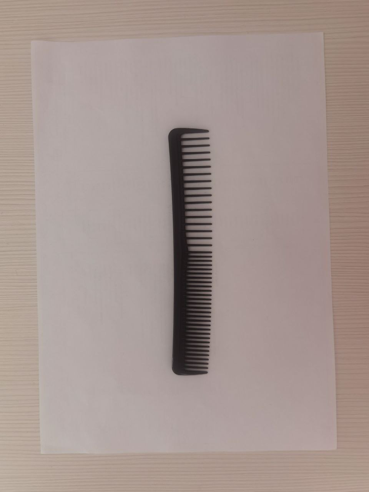 
 
 
 
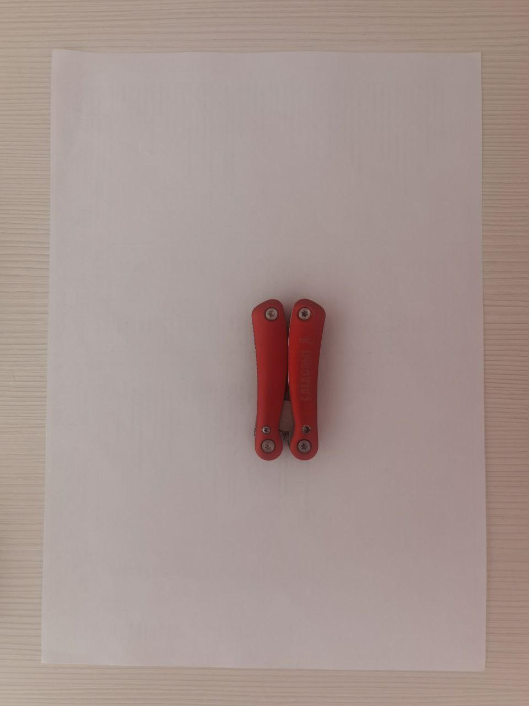 
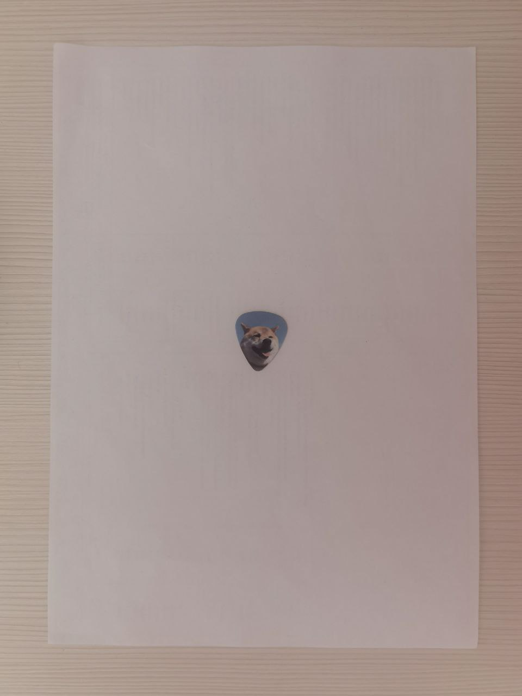 
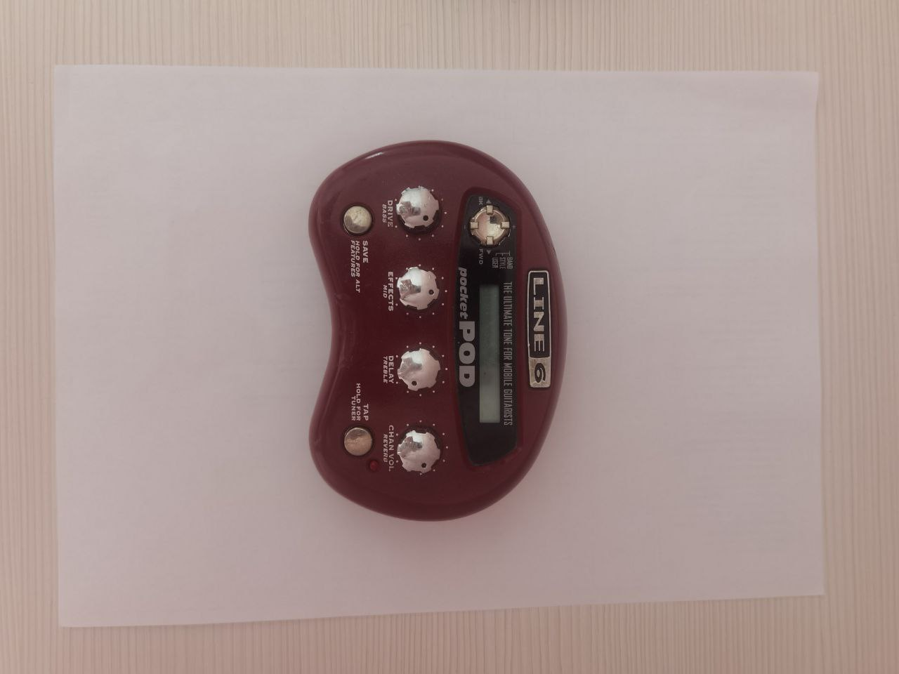 
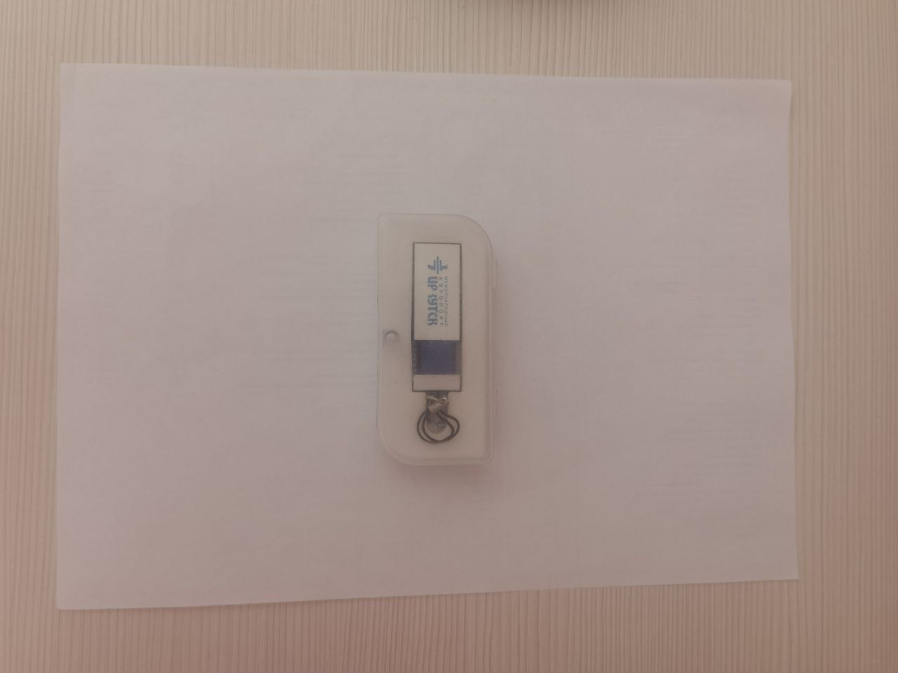 
 

<h3>Изображение фона</h3>

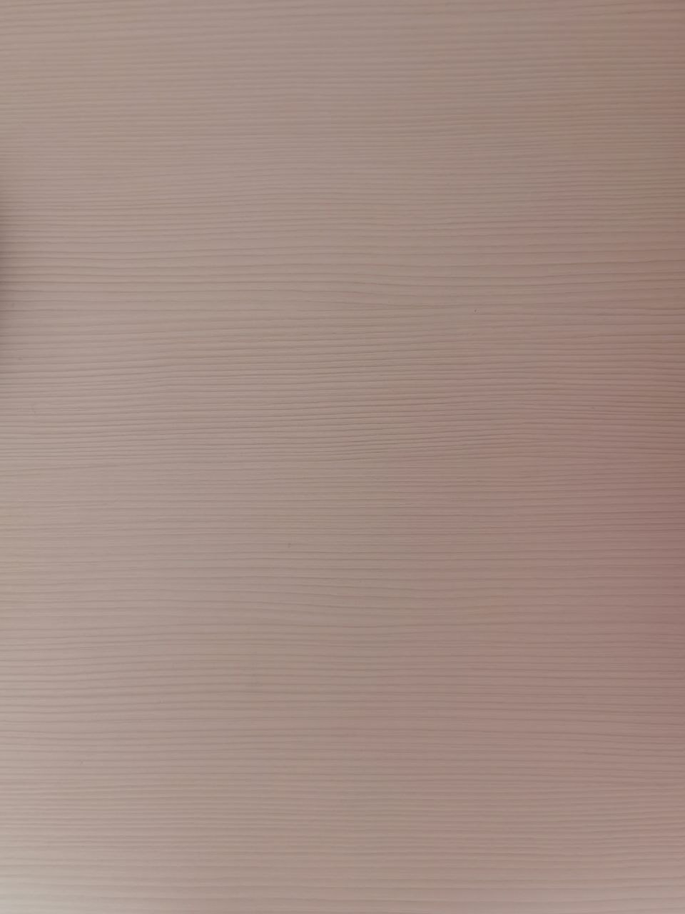 

<small>Не судите строго, камера на телефоне разбита, перефоткаю потом на другую</small>

<h3>Примеры входных данных:</h3>
<b>Пример 1:</b> 
Программа будет работать корректно, все предметы расположены независимо друг от друга, к тому же выпуклые оболочки их крайних точек не пересекются

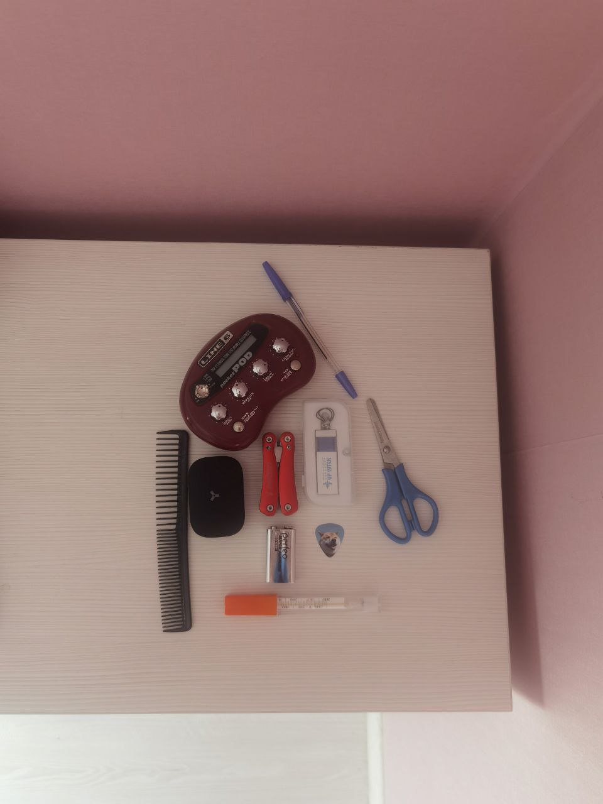 

<b>Пример 2:</b> 
Программа будет работать некорректно, либо выдаст ошибку. Один предмет перекрывает часть другого

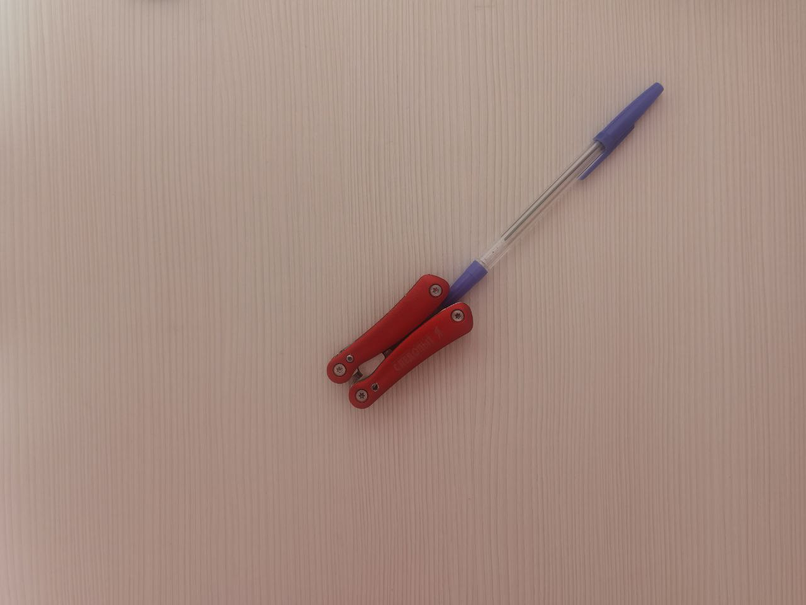 

<b>Пример 3:</b> 
Программа будет работать корректно. Интересный аспект данного случая состоит в том, что выпуклые оболочки крайних точек предметов пересекаются, при этом предметы не перекрывают друг друга

 

<b>Пример 4:</b> 
Программа будет работать корректно. Интересный аспект данного случая состоит в том, что выпуклые оболочки крайних точек предметов пересекаются, при этом предметы не перекрывают друг друга

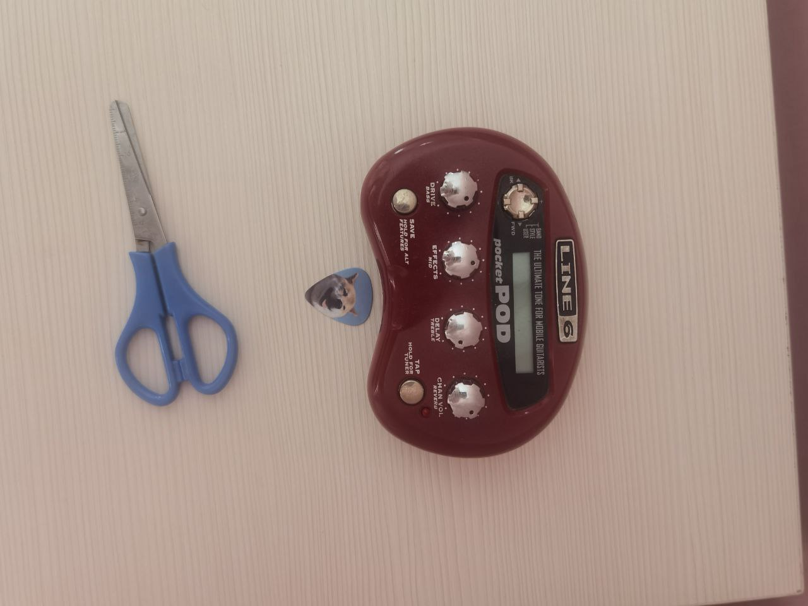 

<b>Пример 5:</b> 
Программа будет работать некорректно, либо выдаст ошибку. Один предмет перекрывает часть другого

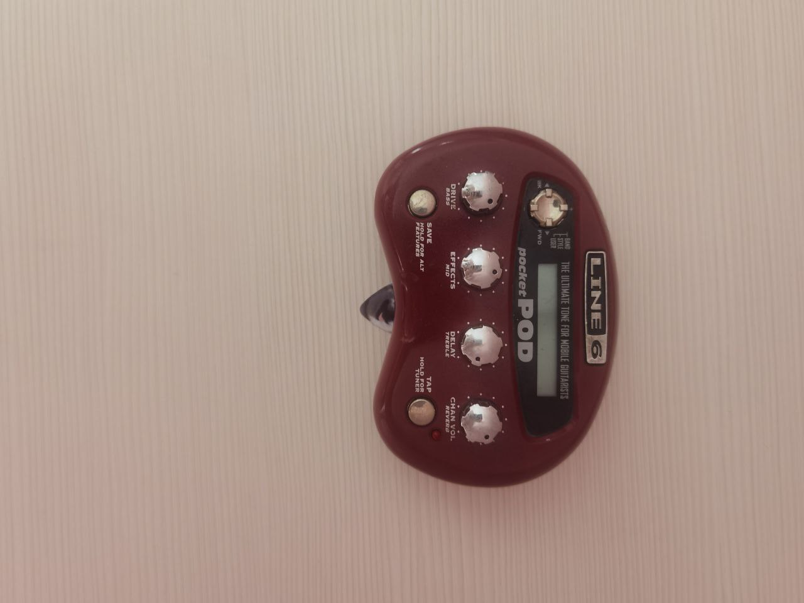 

<b>Пример 6:</b> 
Программа будет работать корректно. Интересный аспект данного случая состоит в том, что выпуклые оболочки крайних точек предметов пересекаются, при этом предметы не перекрывают друг друга

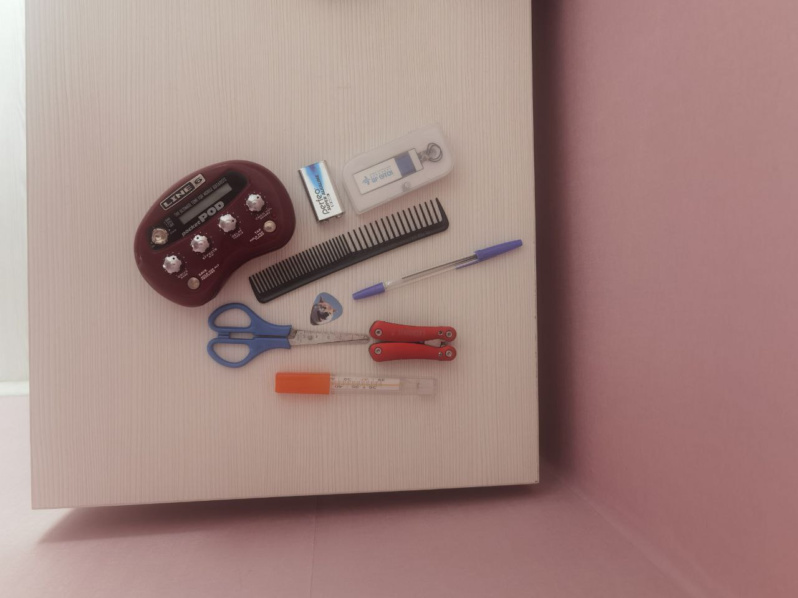 

